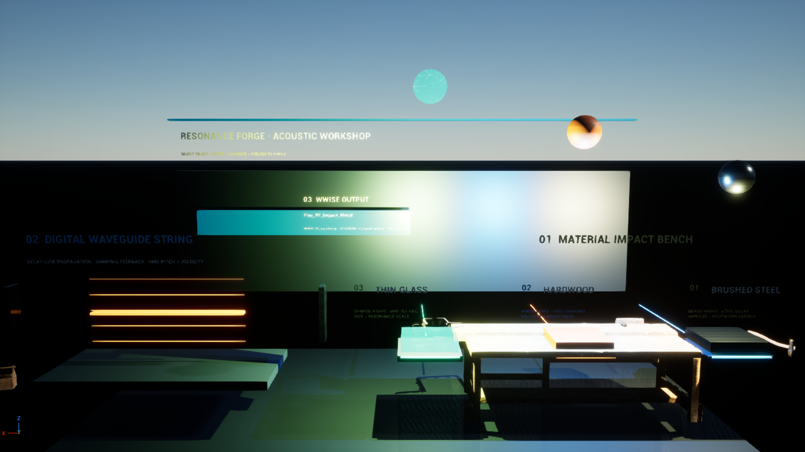
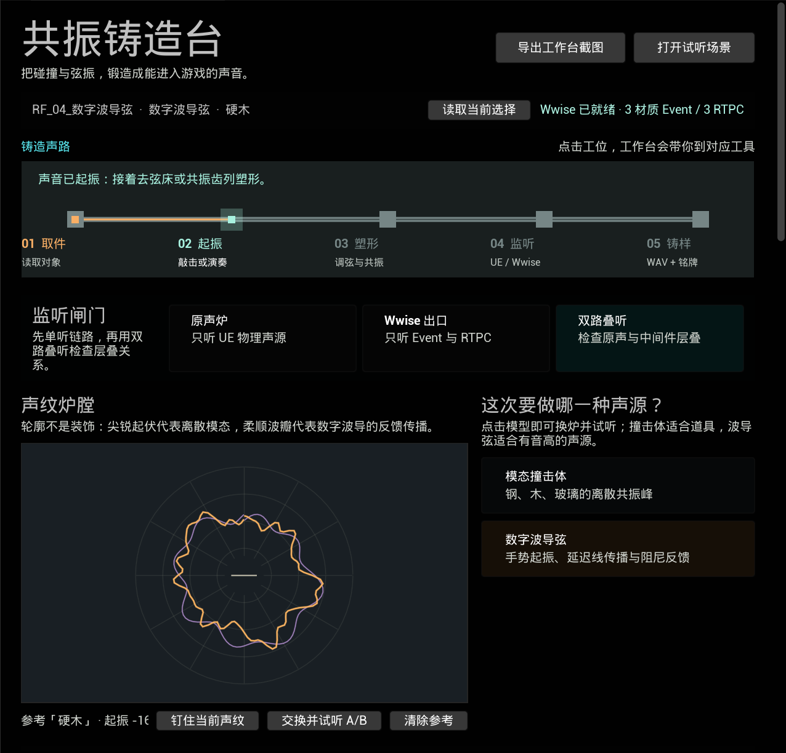
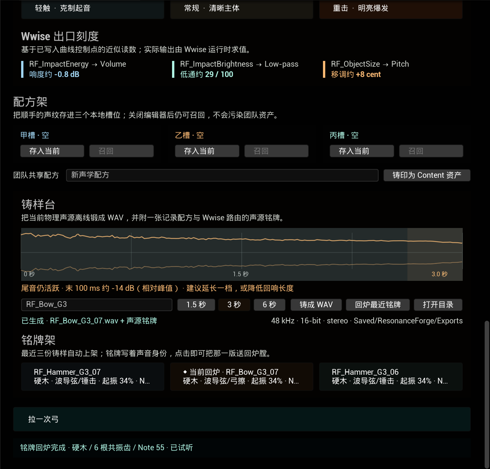
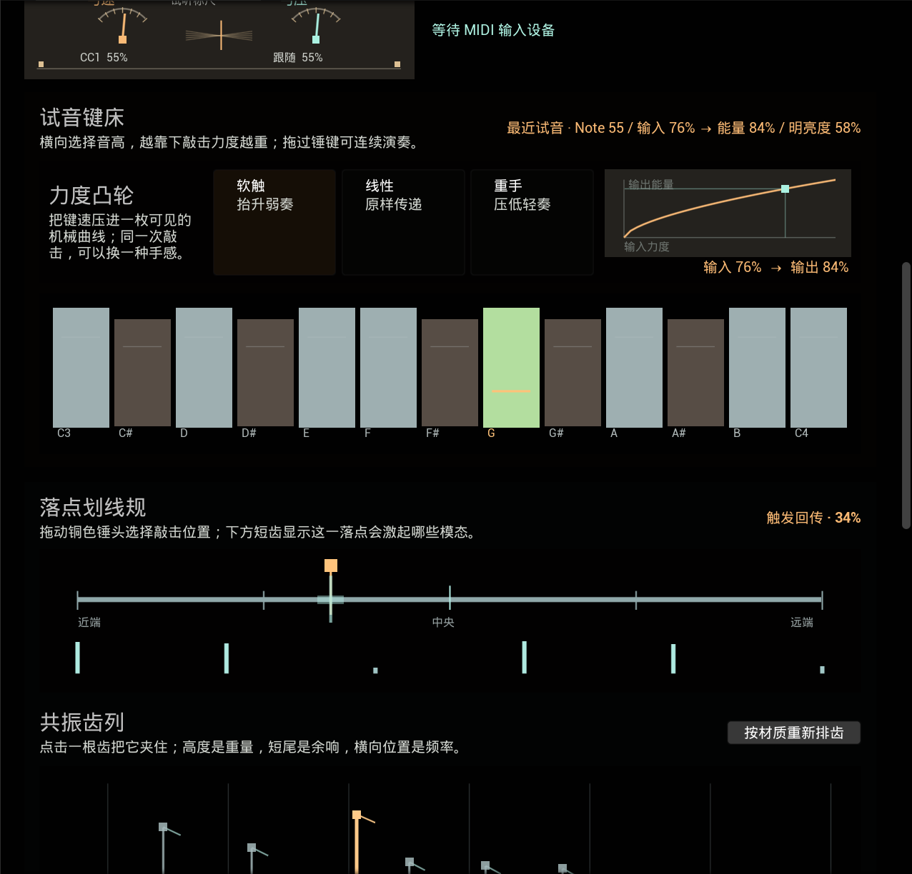
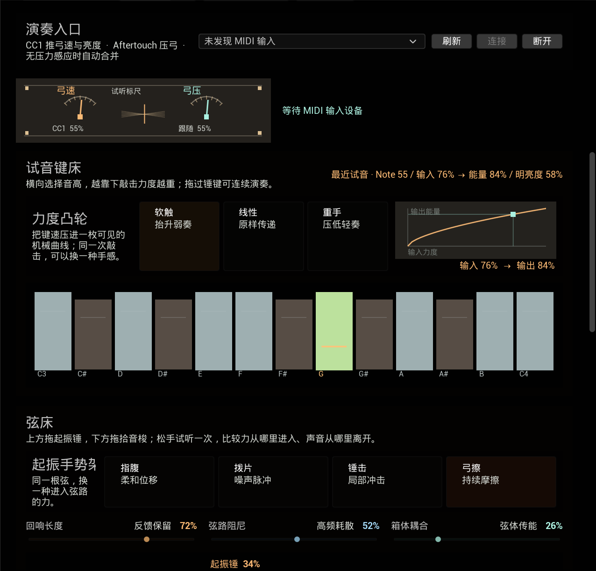
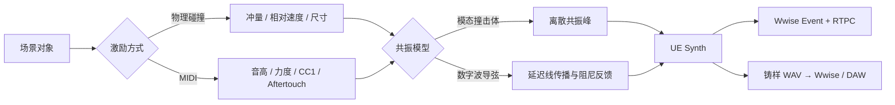

<div align="center">

# 共振铸造台 Resonance Forge

**面向 Unreal 音频开发的物理声源工作台**<br>
把场景碰撞、模态共振、数字波导弦、MIDI 表演和 Wwise 参数发布连接成一条可试听的制作流程。


</div>



工作台从场景中的共振对象出发，接收碰撞、鼠标键床或 MIDI 激励，经过模态/波导塑形后送入 UE Synth 与 Wwise；满意的版本可继续铸成 WAV 和声源铭牌。

## 工作台实机

下面两张图由插件自身的 Slate 截图链路直接导出，不依赖外部录屏或界面拼接。第一张顶部的“铸造声路”把取件、起振、塑形、监听和铸样连成五个可点击工位；铜色余热表示已经走过的环节，青色工位表示最近一次操作。下方呈现当前声纹和紫色参考声纹的 A/B 关系。



第二张呈现三档锤击标尺、Wwise 出口刻度、本地配方槽，以及能判断尾音、切换最近版本的“铸样台 / 余响拓片 / 铭牌架”。



模态撞击体不是固定预设黑盒。第三张用“落点划线规”选择物体上的敲击位置，下方短齿即时显示各模态的受激程度；“共振齿列”则把每一个真实模态放在对数频率轴上，允许逐根调整并试听。



没有 MIDI 硬件时也可以演奏。演奏入口先用“弓感双轮”把弓速、弓压及其回退关系画成可读的机械标尺；未连接时明确标为试听标尺，不伪造硬件输入。试音键床提供 C3–C4 的十三根锤键，横向决定音高，纵向决定原始力度；“力度凸轮”再用软触、线性或重手曲线把输入映射成实际激励能量。点击或拖奏会走和外接 MIDI 相同的 UE/Wwise 触发链。键床下方可以继续选择起振手势，并分别拖动橙色起振锤和青色拾音梭。



## 项目亮点

- **两类实时物理声源**：模态撞击体与八复音数字波导弦。
- **真实场景输入**：碰撞冲量、相对速度和物体尺寸直接影响声音。
- **UE × Wwise 双路径**：UE 原生合成可独立试听，同时按钢、木、玻璃分流 3 个 Wwise Event，并发布 3 个 RTPC。
- **监听闸门**：原声炉、Wwise 出口、双路叠听三档在统一触发层真实分流；面板按钮、试音键床、MIDI、键盘触发与 PIE 碰撞都会遵守当前选择。
- **锤击标尺与出口刻度**：轻触、常规、重击三档手势一键试听，并把 RTPC 曲线翻译成近似的 dB、低通与 cent 读数。
- **可听的直接编辑**：点击材质或模型立即试听；拖动参数时声纹和出口刻度实时变化，松手只触发一次声音，避免连续 Event 互相遮盖。
- **可演奏**：面板可发现并连接 MIDI 输入设备；Note On 控制音高与力度，原生弓擦按住持续、Note Off 进入 140 ms 收弓。CC1 实时控制弓速与明亮度，Channel / Note Aftertouch 独立控制弓压；普通键盘没有压力感应时，弓压自动跟随 CC1。
- **弓感双轮**：演奏入口用两枚机械表盘分别显示弓速与弓压，中间弓毛束随速度偏移、随压力收紧；现场输入、Aftertouch 双路分控与 CC1 回退不再只藏在状态文字里。
- **无需硬件的试音键床**：十三根可点击、可拖奏的锤键把鼠标位置映射为 Note 与 Velocity，方便快速验证波导弦和 Wwise 发布。
- **可见的力度凸轮**：软触、线性、重手三枚曲线把原始 Velocity 映射为激励能量；曲线、输入引线和输出落点实时可见，键床与外接 MIDI 共用同一映射函数。
- **可交付的物理声源铸样**：复用实时 Synth 的同一套模态与波导 DSP，把当前齿列、落点、弦床和演奏参数离线渲染成标准 WAV，可直接交给 Wwise、DAW 或版本库。
- **余响拓片**：铸样后绘制真实振幅包络，并测量最后 100 ms 相对峰值电平；尾音高于 −48 dB 时主动建议延长时长或降低回响，避免交付被生硬截断的样本。
- **声源铭牌**：每份 WAV 同步生成版本化 `.rfrecipe.json`，记录模型、材质、模态、落点、弦床、演奏参数及 Wwise Event / RTPC 输入，让样本离开 UE 后仍带着来源。
- **铭牌回炉**：一键读取铸样目录中最近的 v1 铭牌，校验配套 WAV 和字段边界，再恢复材质、模型、共振齿列、落点、弦床及 Note / Velocity 到当前对象并试听。
- **三格铭牌架**：最近三份铸样按铭牌 UTC 时间自动上架，直接显示文件名、材质、模型、Note、时长与尾音读数；点击任意一格即可回炉，不再只能恢复最新版本。
- **声纹炉膛**：用随模型、材质与演奏参数实时变化的声学指纹理解声音，而不是只看抽象滑杆。
- **可编辑共振齿列**：直接选择离散模态，调整频率、响度权重和衰减时间；结果写回当前声源，并参与 A/B 与共享配方。
- **碰撞位置塑形**：真实 `FHitResult` 落点会转换到物体局部坐标，并按模态节点重新分配各共振峰的激励能量。
- **触发回传与模态余辉**：面板试敲或 PIE 碰撞后，最近发生的共振体会把落点、能量和明亮度回传到划线规；青色余辉随声音衰减。
- **A/B 声纹比较**：钉住一次参考声纹，再更换材质或参数；“交换并试听 A/B”可在两个版本间往返切换。
- **本地配方架**：甲、乙、丙三个槽位保存模型、材质和演奏参数，重开编辑器后仍可召回。
- **可塑形的数字弦**：“弦床”直接控制起振位置、回响长度、弦路阻尼、箱体耦合和拾音位置；力进入弦的位置与声音离开弦的位置可以独立调整。声音、声纹、A/B 参考、配方槽与声源铭牌使用同一组参数。
- **四种波导激励手势**：指腹、拨片、锤击写入不同的初始弦形；弓擦持续计算弓速与弦速的差值，通过非线性摩擦曲线向同一根延迟线补能。鼠标试听使用有限自动弓程，硬件 MIDI 则按键起弓、松键收弓。
- **可拖动的弦路尺**：不把物理位置继续做成抽象滑杆；橙色起振锤回答“力从哪里进入”，青色拾音梭回答“声音从哪里离开”，铜色驻波包络则保留琴桥与弦心参照。
- **团队共享资产**：把当前声音“铸印”为 `UResonanceMaterialProfile`，保存进 Content、挂到当前对象并交给版本控制。
- **可操作的铸造声路**：取件、起振、塑形、监听、铸样五个工位反映最近一次真实操作；点击任一工位会滚动到对应工具，并给出当前最自然的下一步。
- **可重复验证**：测试音频、PBR 贴图、演示地图和复检报告均可由脚本重建。

## 它解决什么问题

传统游戏音效通常从录音文件开始，材质、碰撞强度和物体尺寸只能通过大量样本与分层规则近似。Resonance Forge 用轻量实时模型把这些信息保留到运行时，让音频设计师和技术音频开发者可以：

1. 在 UE 场景里直接选择一个可发声对象；
2. 用物理碰撞或 MIDI 作为激励；
3. 在模态共振与数字波导之间选择合适模型；
4. 调整能量、明亮度和尺度并立即试听；
5. 将相同参数发送给 Wwise，继续进行混音、路由和发布。



## 两种声学模型

| 模型 | 核心结构 | 适用对象 | 可控参数 |
| --- | --- | --- | --- |
| 模态撞击体 | 多组频率、增益与衰减时间不同的共振模态 | 金属板、木块、玻璃、机械结构 | 激励能量、频谱明亮度、共振尺度 |
| 数字波导弦 | 指腹/拨片/锤击初始条件、弓擦持续摩擦、延迟线传播、环路低通、衰减反馈、双点拾音 | 弦、金属丝、可演奏机关 | 激励手势与位置、MIDI 音高、力度、阻尼、反馈、材质耦合与拾音位置 |

数字弦的“回响长度”是面向设计师的归一化控制，内部映射到 `0.9700–0.9995` 的反馈系数；接近上限时衰减会显著变长。“弦路阻尼”决定环路低通造成的高频耗散，“箱体耦合”决定弦能量进入模态共振体的比例。“拾音位置”把琴桥到弦心映射到延迟线长度的 `4%–50%`，将当前波与该位置的延迟波做双点差分，因此改变的是实际输出频谱，而不是只改界面曲线。弦路尺中的驻波外形受回响与阻尼驱动，琴桥下的共鸣基座受耦合驱动，青色拾音梭则直接写入同一个 DSP 参数。

指腹、拨片和锤击改变延迟线的初始条件：指腹使用围绕起振点的宽缓平滑位移，拨片形成以起振点为峰值的三角位移并叠加亮度可塑噪声，锤击在起振点形成局部双极脉冲。弓擦不同：弓点处每个采样都计算“弓速－弦速”，经过形如 STK `BowTable` 的非线性摩擦曲线后持续补能，并用 25 ms 起弓与 140 ms 收弓包络避免硬切。鼠标键床与“拉一次弓”保持约 `0.85–3.2` 秒的自动弓程；硬件 MIDI Note On 建立持音语音，Note Off 才进入收弓。持音时 CC1 经过 18 ms 平滑后改变弓速，Aftertouch 经过 12 ms 平滑后独立改变弓压；未收到 Aftertouch 前，弓压跟随 CC1，因此普通调制轮键盘仍可完成整条演奏路径。CC1 归零只落到最低摩擦，不会误触发 Note Off。

橙色起振锤把归一化位置映射到弦长 `12%–88%`；它和青色拾音梭是两个独立 DSP 参数。四种手势共享音高、反馈、阻尼、箱体与拾音弦路，不切换采样文件。

“力度凸轮”位于手势之前：软触使用 `velocity^0.62` 抬升弱奏，线性保持原值，重手使用 `velocity^1.75` 压低轻奏并为强奏保留更大跨度。鼠标键床与硬件 MIDI Note On 都调用同一函数；物理落球不经过这条演奏曲线。它是轻量数字波导的演奏性控制，不声称复刻琴槌毡层、弦间耦合、音板辐射等 Pianoteq 级完整钢琴模型。

模态撞击体的“共振齿列”直接编辑 `FResonanceMode`：齿位为 `FrequencyHz`，齿重为 `Gain`，余响为 `DecaySeconds`。内置钢、木、玻璃只是可复现的起点；调整后数据保存在当前 Synth 实例中，PIE 仍会使用这组值，铸印共享配方时则写入 Content 资产。按“按材质重新排齿”可随时回到内置模态。

“落点划线规”使用归一化局部位置 `x` 计算第 `n` 根模态的激励权重 `|sin(nπx)|`。因此中央敲击会压低偶数模态，偏向端点时会形成另一组频谱。PIE 中的真实碰撞点、面板拖动和键盘试听使用同一参数；本地配方槽也会保存落点。

触发发生后，运行 Actor 会记录递增序号、落点、能量、明亮度与世界时间。工作台在 PIE 中优先读取运行世界，并从多个共振体里选择最近发生的一次撞击；划线规上的青色记号和模态短齿余辉按能量随时间衰减。自动 README 截图展示的是面板试敲回传，不冒充 PIE 物理碰撞截图。

这组模态负责 UE 原生物理声源；并行的 Wwise 路径仍接收材质 Event 与 Energy、Brightness、ObjectSize 三个 RTPC。工作台不会把尚未写入 Wwise 的单齿编辑伪装成中间件参数。

数字波导结构参考 STK `Plucked` 的 Karplus–Strong 思路，弓擦参考 `BowTable / Bowed` 的速度差摩擦模型，但没有直接嵌入 STK 整库；核心代码针对 Unreal 音频线程和固定复音池重新实现。来源和许可见 [THIRD_PARTY_NOTICES.md](THIRD_PARTY_NOTICES.md)。

## 最快上手

### 环境要求

- Unreal Engine `5.8.1`
- Windows Editor / Win64
- Wwise Authoring 与 SDK `2025.1.10`
- Wwise Unreal Integration `2025.1.10.9233.4458`

### 安装

1. 克隆仓库：

   ```powershell
   git clone https://github.com/Ubik42/resonance-forge.git
   cd resonance-forge
   ```

2. 使用 Audiokinetic Launcher 将 Wwise Integration 安装到 `Demo/Plugins`。仓库不会重新分发 Wwise SDK 或官方插件。
3. 同步当前插件源码并打开工程：

   ```powershell
   ./scripts/sync_demo_plugin.ps1
   Start-Process ./Demo/ResonanceForgeDemo.uproject
   ```

4. 在 Unreal Editor 中打开：

   ```text
   窗口 → 音频工具 → 共振铸造台 · 材质声源工作台
   ```

### 最短成功路径

1. 点击“打开试听场景”。
2. 在场景中选择钢、木、玻璃砧座或数字波导弦。
3. 点击“读取当前选择”。
4. 从顶部“铸造声路”点击“起振”进入键床/MIDI，之后可直接点击“塑形”“监听”或“铸样”跳到相应工具；声路上的余热会随实际操作推进。
5. 选择共振模型和材质预设；每次点击都会立即试听当前结果。
6. 使用模态撞击体时，先拖动“落点划线规”比较近端、中央与远端敲击，再在“共振齿列”点击一根齿，调整齿位、齿重或余响。
7. 先点“轻触 / 常规 / 重击”建立力度参照；每一档都会立即试听，并在“Wwise 出口刻度”显示近似的响度、低通和移调结果。
8. 在“监听闸门”先选“原声炉”确认物理模型，再选“Wwise 出口”确认 Event / RTPC，最后用“双路叠听”检查两条链是否互相遮盖。
9. 再细调激励能量、明亮度与共振尺度：拖动时观察声纹和出口刻度，松手试听一次。
10. 点击“钉住当前声纹”，再切换材质、模态齿或参数，比较并试听两个版本。
11. 点击“交换并试听 A/B”在两版之间往返切换；模态数组也会随版本交换。
12. 使用“配方架”把满意的版本存入甲、乙或丙槽，需要时一键召回到当前对象。
13. 先用“试音键床”点击同一位置，再依次切换软触、线性、重手三枚“力度凸轮”；观察输入力度不变而输出能量和曲线落点改变。有 MIDI 键盘时，在“演奏入口”连接设备；选择弓擦并按住一个音符，先推动 CC1 比较弓速与明亮度，再用 Channel 或 Note Aftertouch 单独施加弓压。没有压力感应的设备会明确显示“CC1 同推弓速与弓压”。
14. 切换到“数字波导弦”，依次试听指腹、拨片、锤击与弓擦；前三种比较起音形态，弓擦重点听一次自动弓程中的持续补能。若有 MIDI 键盘，按住弓擦音符确认持续发声，松键确认自然收弓。再固定手势并分别移动橙色起振锤与青色拾音梭，每次只改变一个空间参数。
15. 在“铸样台”输入文件名并选择 1.5、3 或 6 秒，点击“铸成 WAV”；观察“余响拓片”是否提示尾音仍活跃，必要时延长一档或降低回响长度。工具会成对写入 WAV 与 `.rfrecipe.json` 声源铭牌，重名时自动追加编号。下方“铭牌架”会刷新最近三版，点击任意铭牌即可回炉；“回炉最近铭牌”仍保留为最快入口。
16. 为满意版本输入名称，点击“铸印为 Content 资产”；当前共振齿列会写入 `UResonanceMaterialProfile::Modes`，成为团队可复用配方。
17. 进入 PIE，观察落球碰撞并在 Wwise Profiler 中检查 RTPC。

配方槽写入 Unreal 的本机工程用户设置，不会生成需要提交的团队资产；适合保存个人试听草案。需要团队共享的正式声学资产仍应使用 `UResonanceMaterialProfile`。

“铸样台”输出 `48 kHz / 16-bit / stereo` WAV。它调用实时声源使用的同一套 DSP，不是另一份只为导出编写的近似算法；导出时会保留当前模型、共振齿列、落点、弦床、Note 与力度。监听闸门只决定实时监听路径，不属于声音配方；无论当前选了哪一档，铸样始终输出 UE 原始物理声源，不会把 Wwise Bus 或双路叠听混进文件。输出位于工程 `Saved` 目录，默认不进入 Git，适合先在本地筛选，再按团队规则导入 Wwise 或 DAW。

每次铸样还会生成一张 180 段的“余响拓片”。它从实际双声道采样提取归一化峰值包络，并以最后 100 ms 的 RMS 相对全段峰值判断尾音：低于或等于 `−48 dB` 记为已收束，否则提示延长一档或降低回响。它是剪裁风险提示，不替代响度计、听感判断或正式母带。当前版本导出的是 **UE 物理声源原始铸样**，不包含 Wwise Bus、Effect、空间化或母带处理，也不会声称已经自动导入 Wwise Authoring。

WAV 旁边的 `.rfrecipe.json` 是“声源铭牌”，使用 `resonance-forge/sample-label/v1` 模式。它记录插件与 UE 版本、音频规格、尾音判断、材质与模型、全部离散模态、数字波导参数、Note / Velocity，以及当前 Wwise Event 与 0–100 RTPC 输入。例如：

```json
{
  "schema": "resonance-forge/sample-label/v1",
  "audio": { "file": "RF_Bow_G3.wav", "sampleRate": 48000, "tailRelativeDb": -15.1 },
  "source": { "preset": "硬木", "model": "WaveguideString", "strikePosition": 0.34, "midiNote": 55, "velocity": 0.76 },
  "performance": { "velocityCurve": "SoftTouch", "inputVelocity": 0.76, "outputEnergy": 0.84 },
  "waveguide": { "feedback": 0.99124, "damping": 0.52, "bodyCoupling": 0.26, "pickupPosition": 0.82, "excitation": "Bow" },
  "wwise": { "event": "Play_RF_Impact_Wood", "rtpc0To100": { "RF_ImpactEnergy": 76.0 } }
}
```

铭牌使用 UTF-8 和稳定英文键，中文材质名保留原样。只有 WAV 与 JSON 都写入成功时才报告铸样完成；若 WAV 失败，已写入的铭牌会撤回，避免产生误导性的孤立交付件。`envelopePeaks` 保存 180 段余响拓片，因此重开编辑器后回炉仍能恢复同一张衰减图。

“回炉最近铭牌”会在 `Demo/Saved/ResonanceForge/Exports` 中选择铭牌 UTC 时间最新的 `.rfrecipe.json`。载入前会检查模式版本、配套文件名与实际 RIFF/WAVE 头、48 kHz / 16-bit / stereo 规格、受支持材质与模型，以及全部数值范围；校验通过后才一次性写回当前对象并试听。Wwise Event 不从 JSON 强制写入，而是按恢复后的材质重新推导，避免被过时或手改的路由覆盖。0.20 早期生成的 v1 铭牌还没有 `envelopePeaks`，仍可恢复声源参数，只会明确提示缺少余响拓片。当前版本不会自动修改 Wwise 工程。

“铭牌架”读取铭牌中的 `generatedAtUtc` 排序，避免连续铸样落在相同文件时间片时顺序不稳定。每格只展示做判断真正需要的身份信息；当前回炉版本带 `◆` 标记。列表只保留三个入口，不会把工作台变成通用文件管理器，完整历史仍可通过“打开目录”查看。

### 从个人草案到团队资产

“配方架”承担两种不同用途：

- **甲、乙、丙槽**：保存在本机 `EditorPerProjectUserSettings`，适合临时试音和个人 A/B，不进入版本控制。
- **铸印为 Content 资产**：在 `/Game/ResonanceForge/Profiles` 生成 `UResonanceMaterialProfile`，保存来源材质、模型、离散模态和波导参数，并立即应用到当前对象。重名时自动追加编号。

切换回拉丝钢、硬木、薄玻璃或另一种模型时，工作台会解除当前共享资产，明确回到内置预设，避免两套参数暗中叠加。

仓库自带一份由场景脚本生成的正式示例：

```text
/Game/ResonanceForge/Profiles/DA_RF_LongTailWoodString
```

“长尾木弦”使用硬木六模态、指腹起振、`0.9987` 反馈、`0.22` 阻尼、`0.44` 箱体耦合和 `0.82` 弦心侧拾音位置。基础地图与可选 Fab 地图中的数字波导弦默认引用该资产；磁盘重载复检会同时检查资产路径和完整波导参数。

## 演示场景

### 仓库自带：基础声学工坊

```text
/Game/ResonanceForge/Demo/Maps/L_RF_PhysicsLab
```

左侧为钢、木、玻璃三组物理碰撞砧座，右侧为使用“长尾木弦”共享配方的数字波导弦，后墙集中显示 Wwise Event 与 RTPC 输出。点击 PIE 后，三颗 `18 kg` 落球会从不同高度下落。

### 本机可选：Fab 增强声学工坊

安装 **Carpenter's Workshop Environment** 后运行：

```powershell
./scripts/regenerate_physics_lab.ps1
```

脚本会在本机生成：

```text
/Game/CarpentersWorkshop/ResonanceForge/L_RF_WorkshopShowcase
```

增强地图加入真实木工台、锤、木槌、木板、钢板和工具箱。Fab 源资产与派生地图均被 Git 忽略；插件检测到增强地图时优先打开，否则自动回退基础场景。

## Wwise 映射

碰撞、MIDI 或面板试听会先根据当前材质选择对应的 Wwise 出口；每个出口拥有独立的 Random Container 和软、中、硬三档素材：

| 材质预设 | Event | Random Container | 素材 |
| --- | --- | --- | --- |
| 拉丝钢 | `Play_RF_Impact_Steel` | `RF_Impact_Steel` | `RF_Steel_Soft / Medium / Hard` |
| 硬木 | `Play_RF_Impact_Wood` | `RF_Impact_Wood` | `RF_Wood_Soft / Medium / Hard` |
| 薄玻璃 | `Play_RF_Impact_Glass` | `RF_Impact_Glass` | `RF_Glass_Soft / Medium / Hard` |

三个出口共享同一套设计语义，UE 参数在各材质 Container 内继续塑形：

| Game Parameter | 数据来源 | Wwise 属性 | 曲线范围 |
| --- | --- | --- | --- |
| `RF_ImpactEnergy` | 碰撞冲量 / MIDI Velocity | Voice Volume | `-24 dB → 0 dB` |
| `RF_ImpactBrightness` | 相对速度 / MIDI CC1 | Voice Low-pass | `82 → 0`，数值越高越明亮 |
| `RF_ObjectSize` | 场景对象共振尺度 | Voice Pitch | `+420 → -520 cent` |

曲线由 `scripts/provision_wwise_project.ps1` 通过 WAAPI 写入。脚本会先读取现有声音对象，并逐层核对 RTPC 与 Curve；配置相同时不重复导入 WAV，也不重建曲线 GUID。

工作台中的“Wwise 出口刻度”按这些控制点近似显示当前 dB、Low-pass 与 cent，方便不打开 Authoring 时快速判断调音方向；最终值仍由 Wwise 运行时按实际曲线求值。

## MIDI 映射

| 输入 | 作用 |
| --- | --- |
| Note On 音符 | 数字波导弦音高；模态模型也可作为移调激励 |
| Note On Velocity | 激励能量，并同步到 `RF_ImpactEnergy` |
| CC1 调制轮 | 原生持音弓擦的实时弓速与明亮度，并同步到 Wwise `RF_ImpactBrightness`；未收到 Aftertouch 时也承担弓压 |
| Channel / Note Aftertouch | 独立弓压；Channel 作用于全部持音弓，Note 只作用于对应音符 |

MIDI 设备是可选输入。没有硬件时，“试音键床”会生成同样的 Note 与 Velocity：横向选择 C3–C4，纵向映射 20%–100% 力度，拖过不同锤键可连续演奏。它直接调用 `TriggerInstrument`，不是只改变界面状态；UE Synth 与 Wwise Event / RTPC 是否触发由当前监听闸门决定，触发回传始终更新。

## 工程结构

```text
ResonanceForge
├── Source/ResonanceForgeRuntime   # 模态合成、数字波导与复音池
├── Source/ResonanceForgeWwise     # 碰撞 Actor、MIDI 与 Wwise 桥接
├── Source/ResonanceForgeEditor    # 中文 Slate 声学工作台
├── Demo/Demo_WwiseProject         # 独立 Wwise Authoring 工程
├── Demo/TestAudio/Generated       # 确定性脚本合成撞击 WAV
├── Demo/TestMaterials/Generated   # 自生成钢、木、玻璃 PBR 贴图
├── Demo/Scripts                   # 场景生成、截图与后台复检
├── docs                           # 使用、素材、截图与集成说明
└── scripts                        # 同步、素材生成与一键重建
```

## 可重复重建

```powershell
./scripts/generate_test_impacts.ps1
./scripts/generate_material_textures.ps1
./scripts/sync_demo_plugin.ps1
./scripts/regenerate_physics_lab.ps1
```

随仓库发布的 WAV 与 PBR 贴图均由确定性脚本生成。地图重建完成后会重新从磁盘加载关卡，验证三个物理落球和一个数字波导弦 Actor，而不是只检查脚本是否返回成功。

## 验证证据

| 检查项 | 当前结果 |
| --- | --- |
| UE 5.8 Editor 编译 | 通过 |
| 物理碰撞映射测试 | 通过 |
| 内置声学预设测试 | 通过 |
| 可编辑模态链路 | `FResonanceMode` 写回、A/B 交换与 Content 配方保存通过 UE 编译 |
| 碰撞落点映射 | 世界命中点 → 物体局部位置 → 模态节点激励已进入场景触发链 |
| 多对象触发回传 | 最近撞击 Actor 的落点、能量、明亮度可回到工作台并驱动余辉 |
| 铸造声路状态 | 取件、起振、塑形、监听、铸样五个工位由真实编辑操作推进；点击工位通过 `ScrollDescendantIntoView` 定位到对应 Slate 工具区 |
| 无硬件演奏 | 试音键床 Note / Velocity 进入与外接 MIDI 相同的声源与 Wwise 触发链 |
| 力度响应映射 | 输入 `76%` 在软触凸轮下实际输出约 `84%`；线性为 `76%`，重手约 `62%`；曲线写入本地配方和声源铭牌 |
| 离线物理声源铸样 | 实际生成 3.000 秒、48 kHz、16-bit、双声道 RIFF/WAVE；复用实时 Synth DSP |
| 弦上起振位置隔离比较 | 固定软触凸轮、锤击手势、Note、原始力度、明亮度、回响、阻尼、耦合与拾音位置，仅将起振位置从 `8%` 移至 `82%`；两份 0.29 WAV 的差分 RMS 为 `0.01080`、相关系数为 `0.84956` |
| 弓擦持续补能隔离比较 | 固定 Note 55、输入力度 76%、明亮度 58%、起振点 34% 和整套弦床，只把手势从锤击换成弓擦；两份 0.30 WAV 的差分 RMS 为 `0.02521`、相关系数为 `0.87710`；1.5–2.0 秒相对 0.25–0.5 秒的 RMS 比例分别为 `85.6%` 与 `28.5%` |
| MIDI 持弓与独立弓压 | Note On 持弓 3 秒后仍保留持续能量，Note Off 后进入 140 ms 收弓；同一持音保持弓速不变，把弓压从 `18%` 推至 `92%` 后，稳定段 RMS 从 `0.018793` 变为 `0.031395`，无需重新触发音符 |
| 余响截断提示 | 长尾木弦 3 秒铸样末 100 ms 实测约 −33 dB（相对峰值），正确提示延长时长或降低回响 |
| 声源铭牌 | 实际生成 `sample-label/v1` UTF-8 JSON；WAV 规格、6 个硬木模态、波导参数、Note / Velocity、木材 Event 与 3 个 RTPC 输入均通过字段复核 |
| 铭牌架往返 | 自动铸出同参数的弓擦与锤击两版，再按弓擦铭牌确切路径恢复硬木波导弦、`34%` 弓点、弓擦手势、6 模态、Note 55、76/58/46% 参数与 180 段拓片 |
| Wwise 生成资源检查 | 通过 |
| Wwise 材质路由与 RTPC 映射 | 3 个 Event、9 份 WAV、每个 Container 3 条曲线与 Windows SoundBank 通过 |
| 基础地图磁盘重载 | 3 个落球 + 1 个波导弦通过 |
| Carpenter's Workshop UE 5.8 加载 | 通过，本机可选依赖 |

自动化报告默认输出到 `artifacts/automation-*`，地图与 Fab 复检报告输出到 `Demo/Saved/ResonanceForge`。

## 已知限制

- 当前验证范围是 Windows Editor；尚未把 Cook、Shipping 和其他平台写成已完成能力。
- 波导模型采用经典 Karplus–Strong 结构，不等同于 Pianoteq 一类完整钢琴物理建模系统。
- 锤击手势当前是局部双极初始脉冲；尚未模拟琴槌毡层接触、踏板、弦间耦合、音板传播和复杂辐射体。
- 面板按钮与鼠标键床仍使用有限自动弓程；硬件 MIDI 已支持 Note On 持弓、CC1 弓速、Aftertouch 弓压与 Note Off 收弓。尚未提供换弓方向、弓毛接触位置或双向弦段耦合。
- Wwise 参考 Event 当前仍是一次性触发，Note Off 不会伪造停止逻辑；只有在 Wwise Authoring 中建立并绑定独立 Stop Event 后才会扩展该路径。
- 数字弦的 Wwise 监听支路当前仍使用木材 Event 作为参考层，尚未在 Authoring 工程中建立独立 String Event；界面与铭牌会显示实际 Event 名，不把它描述成 Source Plug-in。
- “铸样台”输出 UE 原始物理声源，不渲染 Wwise Bus、Effect、空间化或响度母带链。
- 铭牌架当前展示本工程铸样目录中的最近三份 v1 文件；尚未提供任意路径选择、搜索或批量导入，也不会自动修改 Wwise 工程。
- Wwise SDK、Unreal Integration 与 Fab 商业素材必须由使用者自行安装。

## 文档

- [演示与截图指南](docs/演示与截图指南.md)
- [测试素材说明](docs/测试素材说明.md)
- [Wwise 集成记录](docs/Wwise集成记录.md)
- [产品与技术选型](docs/产品与技术选型.md)
- [第三方代码与算法说明](THIRD_PARTY_NOTICES.md)

## 许可证

项目代码采用 [MIT License](LICENSE)。Wwise SDK、Wwise Unreal Integration、Fab 素材和其他第三方内容继续遵循各自许可，本仓库不授予其再分发权。
