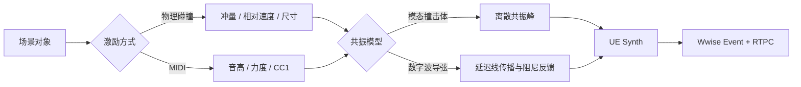

<div align="center">

# 共振铸造台 Resonance Forge

**面向 Unreal 音频开发的物理声源工作台**<br>
把场景碰撞、模态共振、数字波导弦、MIDI 表演和 Wwise 参数发布连接成一条可试听的制作流程。


</div>


> 这不是一个“替你生成音效”的黑盒按钮，而是一套可检查的声源原型：选择场景对象，施加碰撞或 MIDI 激励，决定共振模型，再把同一组参数同步交给 UE Synth 与 Wwise。

## 工作台实机

下面两张图由插件自身的 Slate 截图链路直接导出，不依赖外部录屏或界面拼接。第一张呈现对象、激励、共振与 Wwise 出口，以及当前声纹和紫色参考声纹的 A/B 关系。


第二张呈现数字波导弦的“弦床”、材质听感、RTPC 塑形、本地配方槽与团队 Content 资产铸印。


## 项目亮点

- **两类实时物理声源**：模态撞击体与八复音数字波导弦。
- **真实场景输入**：碰撞冲量、相对速度和物体尺寸直接影响声音。
- **UE × Wwise 双路径**：UE 原生合成可独立试听，同时发布 Wwise Event 与 3 个 RTPC。
- **可演奏**：面板可发现并连接 MIDI 输入设备；Note On 控制音高与力度，CC1 控制音色明亮度，并显示实时演奏状态。
- **声纹炉膛**：用随模型、材质与演奏参数实时变化的声学指纹理解声音，而不是只看抽象滑杆。
- **A/B 声纹比较**：钉住一次参考声纹，再更换材质或参数；“交换并试听 A/B”可在两个版本间往返切换。
- **本地配方架**：甲、乙、丙三个槽位保存模型、材质和演奏参数，重开编辑器后仍可召回。
- **可塑形的数字弦**：“弦床”直接控制回响长度、弦路阻尼和箱体耦合，声音、声纹、A/B 参考与配方槽使用同一组参数。
- **团队共享资产**：把当前声音“铸印”为 `UResonanceMaterialProfile`，保存进 Content、挂到当前对象并交给版本控制。
- **编辑器工作流**：中文 Slate 面板按“对象 → 激励 → 共振 → 出口”组织一件声音的配方。
- **可重复验证**：测试音频、PBR 贴图、演示地图和复检报告均可由脚本重建。

## 它解决什么问题

传统游戏音效通常从录音文件开始，材质、碰撞强度和物体尺寸只能通过大量样本与分层规则近似。Resonance Forge 用轻量实时模型把这些信息保留到运行时，让音频设计师和技术音频开发者可以：

1. 在 UE 场景里直接选择一个可发声对象；
2. 用物理碰撞或 MIDI 作为激励；
3. 在模态共振与数字波导之间选择合适模型；
4. 调整能量、明亮度和尺度并立即试听；
5. 将相同参数发送给 Wwise，继续进行混音、路由和发布。



## 两种声学模型

| 模型 | 核心结构 | 适用对象 | 可控参数 |
| --- | --- | --- | --- |
| 模态撞击体 | 多组频率、增益与衰减时间不同的共振模态 | 金属板、木块、玻璃、机械结构 | 激励能量、频谱明亮度、共振尺度 |
| 数字波导弦 | 噪声激励、延迟线传播、环路低通、衰减反馈 | 弦、金属丝、可演奏机关 | MIDI 音高、力度、阻尼、反馈与材质耦合 |

数字弦的“回响长度”是面向设计师的归一化控制，内部映射到 `0.9700–0.9995` 的反馈系数；接近上限时衰减会显著变长。“弦路阻尼”决定环路低通造成的高频耗散，“箱体耦合”决定弦能量进入模态共振体的比例。

数字波导结构参考 STK `Plucked` 的 Karplus–Strong 思路，但没有直接嵌入 STK 整库；核心代码针对 Unreal 音频线程和固定复音池重新实现。来源和许可见 [THIRD_PARTY_NOTICES.md](THIRD_PARTY_NOTICES.md)。

## 最快上手

### 环境要求

- Unreal Engine `5.8.1`
- Windows Editor / Win64
- Wwise Authoring 与 SDK `2025.1.10`
- Wwise Unreal Integration `2025.1.10.9233.4458`

### 安装

1. 克隆仓库：

   ```powershell
   git clone https://github.com/Ubik42/resonance-forge.git
   cd resonance-forge
   ```

2. 使用 Audiokinetic Launcher 将 Wwise Integration 安装到 `Demo/Plugins`。仓库不会重新分发 Wwise SDK 或官方插件。
3. 同步当前插件源码并打开工程：

   ```powershell
   ./scripts/sync_demo_plugin.ps1
   Start-Process ./Demo/ResonanceForgeDemo.uproject
   ```

4. 在 Unreal Editor 中打开：

   ```text
   窗口 → 音频工具 → 共振铸造台 · 材质声源工作台
   ```

### 最短成功路径

1. 点击“打开试听场景”。
2. 在场景中选择钢、木、玻璃砧座或数字波导弦。
3. 点击“读取当前选择”。
4. 选择共振模型和材质预设。
5. 调整激励能量、明亮度与共振尺度，观察“声纹炉膛”的轮廓变化。
6. 点击“钉住当前声纹”，再切换材质或参数，比较紫色参考轮廓与当前声纹。
7. 点击“交换并试听 A/B”在两版之间往返切换；每次交换都会立即触发当前版本。
8. 使用“配方架”把满意的版本存入甲、乙或丙槽，需要时一键召回到当前对象。
9. 有 MIDI 键盘时，在“演奏入口”选择设备并点击“连接”；弹奏键盘或推动调制轮观察 Note、Velocity 与 CC1。
10. 切换到“数字波导弦”，调节弦床中的回响长度、弦路阻尼和箱体耦合，观察声纹与听感同步变化。
11. 为满意版本输入名称，点击“铸印为 Content 资产”，将它转成团队可复用的正式配方。
12. 进入 PIE，观察落球碰撞并在 Wwise Profiler 中检查 RTPC。

配方槽写入 Unreal 的本机工程用户设置，不会生成需要提交的团队资产；适合保存个人试听草案。需要团队共享的正式声学资产仍应使用 `UResonanceMaterialProfile`。

### 从个人草案到团队资产

“配方架”承担两种不同用途：

- **甲、乙、丙槽**：保存在本机 `EditorPerProjectUserSettings`，适合临时试音和个人 A/B，不进入版本控制。
- **铸印为 Content 资产**：在 `/Game/ResonanceForge/Profiles` 生成 `UResonanceMaterialProfile`，保存来源材质、模型、离散模态和波导参数，并立即应用到当前对象。重名时自动追加编号。

切换回拉丝钢、硬木、薄玻璃或另一种模型时，工作台会解除当前共享资产，明确回到内置预设，避免两套参数暗中叠加。

仓库自带一份由场景脚本生成的正式示例：

```text
/Game/ResonanceForge/Profiles/DA_RF_LongTailWoodString
```

“长尾木弦”使用硬木六模态、`0.9987` 反馈、`0.22` 阻尼和 `0.44` 箱体耦合。基础地图与可选 Fab 地图中的数字波导弦默认引用该资产；磁盘重载复检会同时检查资产路径和三项参数。

## 演示场景

### 仓库自带：基础声学工坊

```text
/Game/ResonanceForge/Demo/Maps/L_RF_PhysicsLab
```

左侧为钢、木、玻璃三组物理碰撞砧座，右侧为使用“长尾木弦”共享配方的数字波导弦，后墙集中显示 Wwise Event 与 RTPC 输出。点击 PIE 后，三颗 `18 kg` 落球会从不同高度下落。

### 本机可选：Fab 增强声学工坊

安装 **Carpenter's Workshop Environment** 后运行：

```powershell
./scripts/regenerate_physics_lab.ps1
```

脚本会在本机生成：

```text
/Game/CarpentersWorkshop/ResonanceForge/L_RF_WorkshopShowcase
```

增强地图加入真实木工台、锤、木槌、木板、钢板和工具箱。Fab 源资产与派生地图均被 Git 忽略；插件检测到增强地图时优先打开，否则自动回退基础场景。

## Wwise 映射

`Play_RF_Impact_Metal` 由碰撞、MIDI 或面板试听触发。三个 UE 参数进入 Wwise 后继续塑造同一个 `RF_Impact_Metal` Random Container：

| Game Parameter | 数据来源 | Wwise 属性 | 曲线范围 |
| --- | --- | --- | --- |
| `RF_ImpactEnergy` | 碰撞冲量 / MIDI Velocity | Voice Volume | `-24 dB → 0 dB` |
| `RF_ImpactBrightness` | 相对速度 / MIDI CC1 | Voice Low-pass | `82 → 0`，数值越高越明亮 |
| `RF_ObjectSize` | 场景对象共振尺度 | Voice Pitch | `+420 → -520 cent` |

曲线由 `scripts/provision_wwise_project.ps1` 通过 WAAPI 写入。脚本会先读取现有声音对象，并逐层核对 RTPC 与 Curve；配置相同时不重复导入 WAV，也不重建曲线 GUID。

## MIDI 映射

| 输入 | 作用 |
| --- | --- |
| Note On 音符 | 数字波导弦音高；模态模型也可作为移调激励 |
| Note On Velocity | 激励能量，并同步到 `RF_ImpactEnergy` |
| CC1 调制轮 | 音色明亮度，并同步到 `RF_ImpactBrightness` |

MIDI 设备是可选输入。没有硬件时，面板试听按钮、键盘触发和物理碰撞仍可独立工作。

## 工程结构

```text
ResonanceForge
├── Source/ResonanceForgeRuntime   # 模态合成、数字波导与复音池
├── Source/ResonanceForgeWwise     # 碰撞 Actor、MIDI 与 Wwise 桥接
├── Source/ResonanceForgeEditor    # 中文 Slate 声学工作台
├── Demo/Demo_WwiseProject         # 独立 Wwise Authoring 工程
├── Demo/TestAudio/Generated       # 确定性脚本合成撞击 WAV
├── Demo/TestMaterials/Generated   # 自生成钢、木、玻璃 PBR 贴图
├── Demo/Scripts                   # 场景生成、截图与后台复检
├── docs                           # 使用、素材、截图与集成说明
└── scripts                        # 同步、素材生成与一键重建
```

## 可重复重建

```powershell
./scripts/generate_test_impacts.ps1
./scripts/generate_material_textures.ps1
./scripts/sync_demo_plugin.ps1
./scripts/regenerate_physics_lab.ps1
```

随仓库发布的 WAV 与 PBR 贴图均由确定性脚本生成。地图重建完成后会重新从磁盘加载关卡，验证三个物理落球和一个数字波导弦 Actor，而不是只检查脚本是否返回成功。

## 验证证据

| 检查项 | 当前结果 |
| --- | --- |
| UE 5.8 Editor 编译 | 通过 |
| 物理碰撞映射测试 | 通过 |
| 内置声学预设测试 | 通过 |
| Wwise 生成资源检查 | 通过 |
| Wwise RTPC 映射检查 | 3 条曲线与 Windows SoundBank 通过 |
| 基础地图磁盘重载 | 3 个落球 + 1 个波导弦通过 |
| Carpenter's Workshop UE 5.8 加载 | 通过，本机可选依赖 |

自动化报告默认输出到 `artifacts/automation-*`，地图与 Fab 复检报告输出到 `Demo/Saved/ResonanceForge`。

## 已知限制

- 当前验证范围是 Windows Editor；尚未把 Cook、Shipping 和其他平台写成已完成能力。
- 波导模型采用经典 Karplus–Strong 结构，不等同于 Pianoteq 一类完整钢琴物理建模系统。
- 尚未模拟琴槌接触、踏板、弦间耦合、音板传播和复杂辐射体。
- Wwise SDK、Unreal Integration 与 Fab 商业素材必须由使用者自行安装。

## 文档

- [演示与截图指南](docs/演示与截图指南.md)
- [测试素材说明](docs/测试素材说明.md)
- [Wwise 集成记录](docs/Wwise集成记录.md)
- [产品与技术选型](docs/产品与技术选型.md)
- [第三方代码与算法说明](THIRD_PARTY_NOTICES.md)

## 许可证

项目代码采用 [MIT License](LICENSE)。Wwise SDK、Wwise Unreal Integration、Fab 素材和其他第三方内容继续遵循各自许可，本仓库不授予其再分发权。
